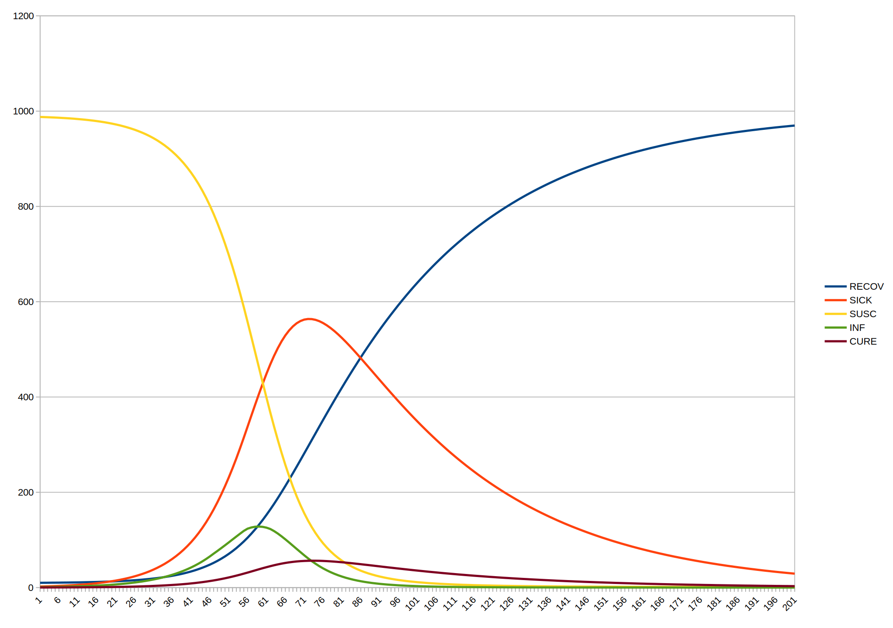
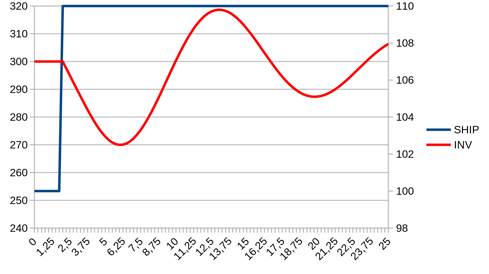
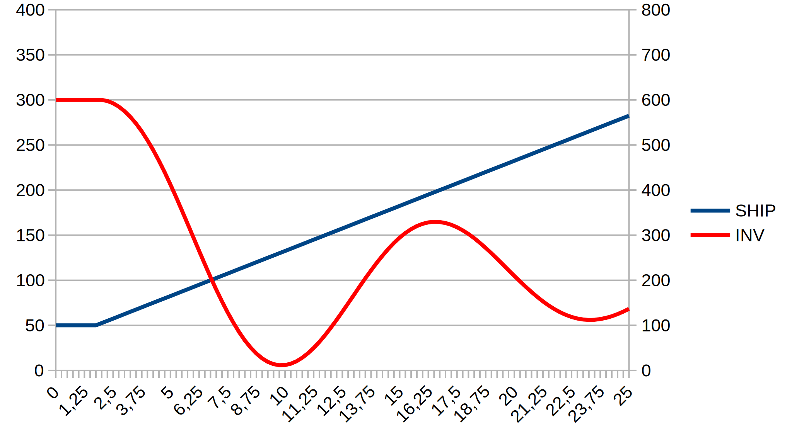
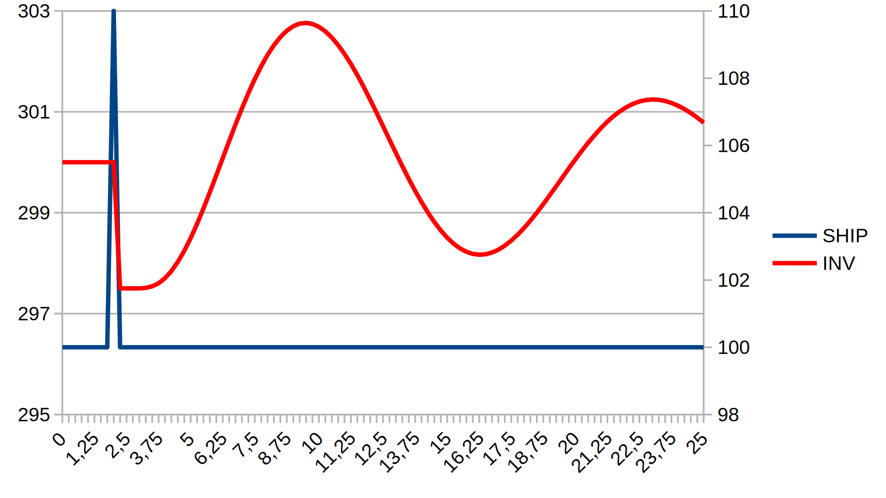
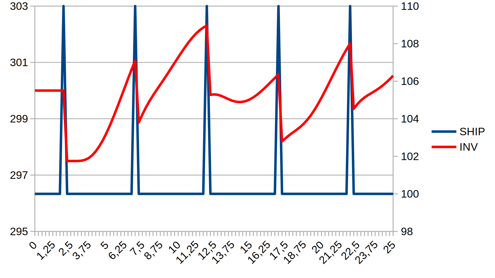
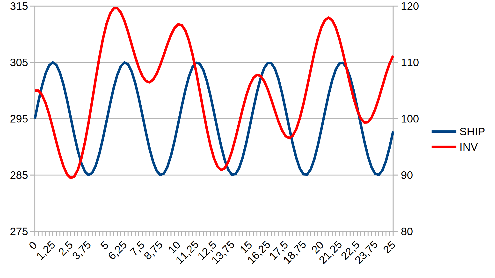
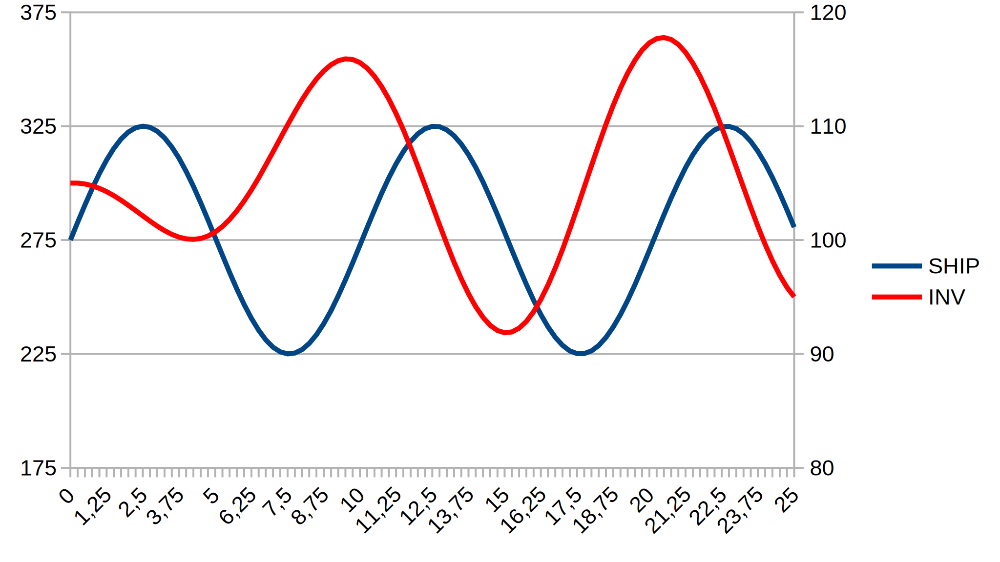
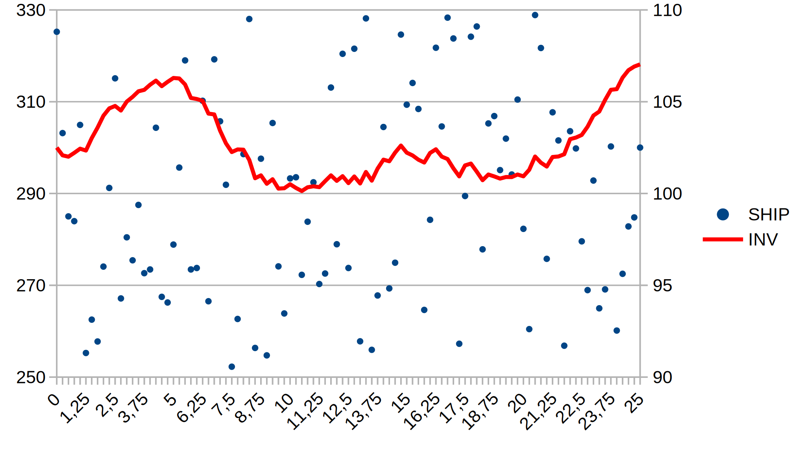

Example models specified in the DYNAMO programming language
===========================================================

## Real-world models

### CHECO / Project CYBERSYN (checo.dynamo)

When in 1972 [Stafford Beer](https://en.wikipedia.org/wiki/Stafford_Beer)
decided to use the DYNAMO programming language for the economic simulator in
the project [Cyberstride](https://en.wikipedia.org/wiki/Project_Cybersyn), he
asked Ron Anderton, the leading expert for DYNAMO in the UK, to start working
on an implementation of a software that later became known as CHECO (CHilean
ECOnomy). Together with K.A.Gilligan he designed an initial version; most of
the work on coding the CHECO simulator had taken place at Queens Mary College
in London. The software design was later continued by Chilean members of the
CHECO team with the support and coaching of Anderton.

"By September 1972, the economic model described by the CHECO team, which by
its own admission was 'relatively simple and incomplete', included an inflation
model that took into account the levels of goods and services, productive
captial, investment funds, prices and the total currency in the economy." (see
page 106 of the book "Cybernetic Revolutionaries" by Eden Medina, MIT Press)

This version of the CHECO simulator is presented here; the design sketch and
the source code for version 1.0 (September 10th, 1972) are from the document
"Futuro at September 1972", contained in Box 58 of the Stafford Beer Collection
at Liverpool John Moores University.

<table>
<tr>
<td width="30%">
  
</td>
<td width="10%"/>
<td width="30%">

<ul>
<li><b>STB</b> = Stocks</li>
<li><b>CP</b> = Productive capital</li>
<li><b>CPD</b> = Available capital</li>
<li><b>FIN</b> = Funds</li>
<li><b>NVR</b> = Price level (right scale)</li>
<li><b>CIR</b> = Cash</li>
</ul>
</td>
</tr>
</table>

## Example models

The example models in this folder are taken from the book
**Introduction to System Dynamics Modeling with DYNAMO** by George P.
Richardson and Alexander L. Pugh III, The MIT Press, 1981 (ISBN
0-262-18102-9).

### flu.dynamo

A simple epidemic model (Page 96, Figure 3.7)

  

### inventory.dynamo

A simple inventory control model (Page 124, Figure 3.25)

This is a base model to show the effects of different test functions (STEP,
RAMP, NOISE,...) in a model run. See the following specific models which
were executed for 100 epochs (101 iterations):

<table>
<tr>
<td width="30%">

<b>inv-1.dynamo</b>

Run with `TEST1=1` (Page 125, Figure 3.26) to enable the `STEP` function.

  

</td>
<td width="30%">

<b>inv-2.dynamo</b>

Run with `TEST2=1` (Page 126, Figure 3.27) to enable the `RAMP` function.

  

</td>
</tr>
<tr>
<td width="30%">

<b>inv-3.dynamo</b>

Run with `TEST3=1` and `INTVL=200` (Page 128, Figure 3.28) to enable the `PULSE` function.

  

</td>
<td width="30%">

<b>inv-4.dynamo</b>

Run with `TEST3=1` and `INTVL=5` (Page 129, Figure 3.29) to enable the `PULSE` function.

  

</td>
</tr>
<tr>
<td width="30%">

<b>inv-5.dynamo</b>

Run with `TEST4=1` and `PER=5` (Page 130, Figure 3.30) to enable the `SIN` function.

  

</td>
<td width="30%">

<b>inv-6.dynamo</b>

Run with `TEST4=1` and `PER=10` (Page 131, Figure 3.31) to enable the `SIN` function.

  

</td>
</tr>
<tr>
<td width="30%">

<b>inv-7.dynamo</b>

Run with `TEST5=1` (Page 132, Figure 3.32) to enable the `NOISE` function.

N.B.: The graph is slightly different from the book,as `NOISE` involves
randomness; re-running the model would also generate a different graph.

  

</td>
<td/>
</tr>
</table>
