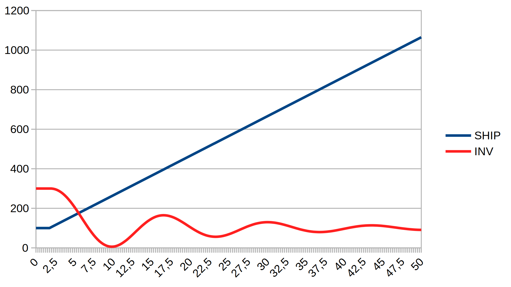
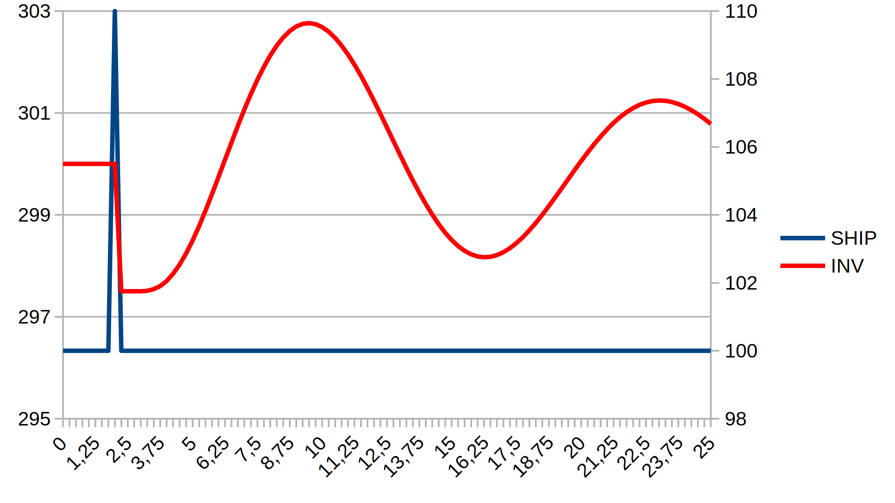
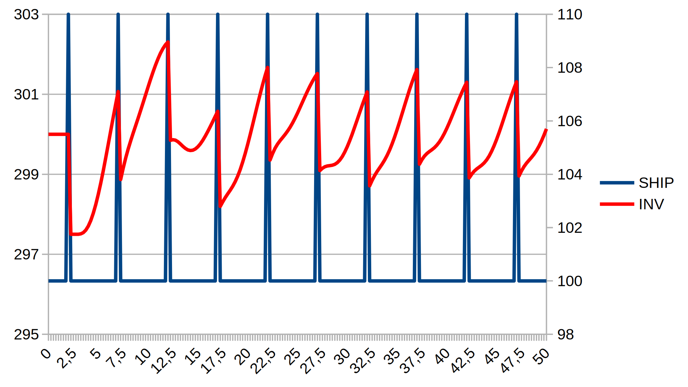
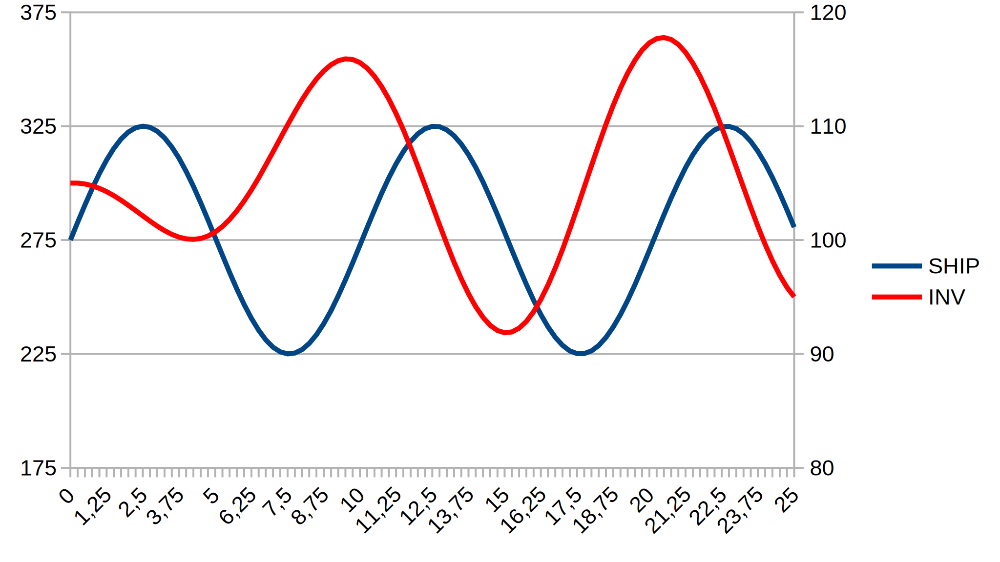

Example models specified in the DYNAMO programming language
===========================================================

(c) 2020 Bernd Fix <brf@hoi-polloi.org>   >Y<

Dynamo is free software: you can redistribute it and/or modify it
under the terms of the GNU Affero General Public License as published
by the Free Software Foundation, either version 3 of the License,
or (at your option) any later version.

Dynamo is distributed in the hope that it will be useful, but
WITHOUT ANY WARRANTY; without even the implied warranty of
MERCHANTABILITY or FITNESS FOR A PARTICULAR PURPOSE.  See the GNU
Affero General Public License for more details.

You should have received a copy of the GNU Affero General Public License
along with this program.  If not, see <http://www.gnu.org/licenses/>.

SPDX-License-Identifier: AGPL3.0-or-later

## Example models

The example models in this folder are taken from the book
**Introduction to System Dynamics Modeling with DYNAMO** by George P.
Richardson and Alexander L. Pugh III, The MIT Press, 1981 (ISBN
0-262-18102-9).

### flu.dynamo

A simple epidemic model (Page 96, Figure 3.7)

  

### inventory.dynamo

A simple inventory control model (Page 124, Figure 3.25)

This is a base model to show the effects of different test functions (STEP,
RAMP, NOISE,...) in a model run. See the following specific models which
were executed for 100 epochs (101 iterations):

<table>
<tr>
<td width="30%">

<b>inv-1.dynamo</b>

Run with `TEST1=1` (Page 125, Figure 3.26) to enable the `STEP` function.

  

</td>
<td width="30%">

<b>inv-2.dynamo</b>

Run with `TEST2=1` (Page 126, Figure 3.27) to enable the `RAMP` function.

  

</td>
</tr>
<tr>
<td width="30%">

<b>inv-3.dynamo</b>

Run with `TEST3=1` and `INTVL=200` (Page 128, Figure 3.28) to enable the `PULSE` function.

  

</td>
<td width="30%">

<b>inv-4.dynamo</b>

Run with `TEST3=1` and `INTVL=5` (Page 129, Figure 3.29) to enable the `PULSE` function.

  

</td>
</tr>
<tr>
<td width="30%">

<b>inv-5.dynamo</b>

Run with `TEST4=1` and `PER=5` (Page 130, Figure 3.30) to enable the `SIN` function.

  

</td>
<td width="30%">

<b>inv-6.dynamo</b>

Run with `TEST4=1` and `PER=10` (Page 131, Figure 3.31) to enable the `SIN` function.

  

</td>
</tr>
<tr>
<td width="30%">

<b>inv-7.dynamo</b>

Run with `TEST5=1` (Page 132, Figure 3.32) to enable the `NOISE` function.

N.B.: The graph is slightly different from the book,as `NOISE` involves
randomness; re-running the model would also generate a different graph.

  

</td>
<td/>
</tr>
</table>
