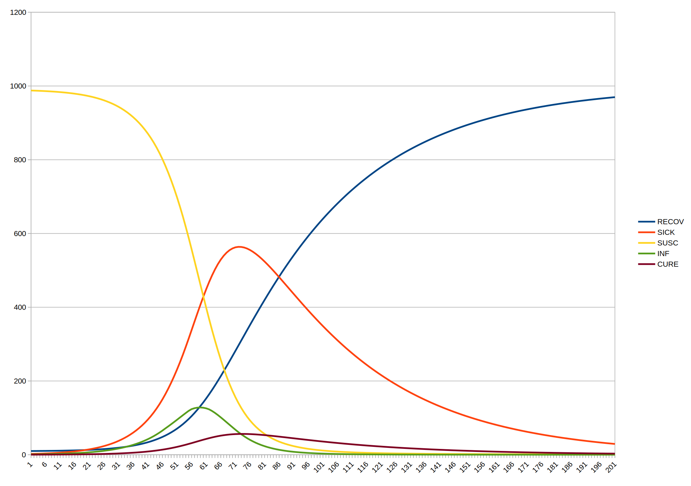
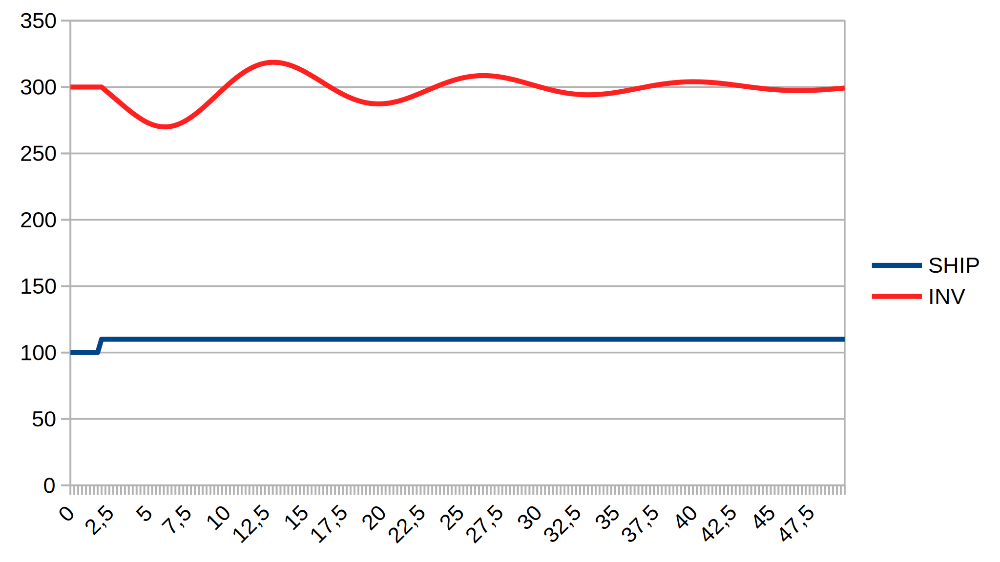

Example models specified in the DYNAMO programming language
===========================================================

(c) 2020 Bernd Fix <brf@hoi-polloi.org>   >Y<

Dynamo is free software: you can redistribute it and/or modify it
under the terms of the GNU Affero General Public License as published
by the Free Software Foundation, either version 3 of the License,
or (at your option) any later version.

Dynamo is distributed in the hope that it will be useful, but
WITHOUT ANY WARRANTY; without even the implied warranty of
MERCHANTABILITY or FITNESS FOR A PARTICULAR PURPOSE.  See the GNU
Affero General Public License for more details.

You should have received a copy of the GNU Affero General Public License
along with this program.  If not, see <http://www.gnu.org/licenses/>.

SPDX-License-Identifier: AGPL3.0-or-later

## Example models

The example models in this folder are taken from the book
**Introduction to System Dynamics Modeling with DYNAMO** by George P.
Richardson and Alexander L. Pugh III, The MIT Press, 1981 (ISBN
0-262-18102-9).

### flu.dynamo

A simple epidemic model (Page 96, Figure 3.7)

### inventory.dynamo

A simple inventory control model (Page 124, Figure 3.25)

This is a base model to show the effects of different test functions (STEP,
RAMP, NOISE,...) in a model run.

### inv-1.dynamo

Run with `TEST=1` (Page 125, Figure 3.26)

