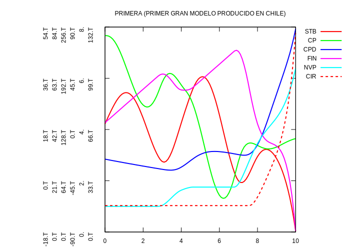

# CHECO / Project CYBERSYN

When in 1972 [Stafford Beer](https://en.wikipedia.org/wiki/Stafford_Beer)
decided to use the DYNAMO programming language for the economic simulator in
the project [Cyberstride](https://en.wikipedia.org/wiki/Project_Cybersyn), he
asked Ron Anderton, the leading expert for DYNAMO in the UK, to start working
on an implementation of a software that later became known as CHECO (CHilean
ECOnomy). Together with K.A.Gilligan they designed an initial version; most of
the work on coding the CHECO simulator took place at Queens Mary College in
London. The software design was later continued by Chilean members of the
CHECO team with the support and coaching from Anderton.

"By September 1972, the economic model described by the CHECO team, which by
its own admission was 'relatively simple and incomplete', included an inflation
model that took into account the levels of goods and services, productive
captial, investment funds, prices and the total currency in the economy." (see
page 106 of the book "Cybernetic Revolutionaries" by Eden Medina, MIT Press)

This version of the CHECO simulator is presented here; the design sketch and
the source code for version 1.0 (September 10th, 1972) are from the document
"Futuro at September 1972", contained in Box 58 of the Stafford Beer Collection
at Liverpool John Moores University.

<table>
<tr>
<td width="30%" valign="top">

<h2>CHECO design sketch (September 10th, 1972)</h2>


<h2>CHECO original output</h2>


The original plot looks a bit different from the one generated by the DYNAMO
interpreter; this is due to combined Y-axis settings.

The sinodial form of the stock curve seems to be a model error; the note on
the design sketch annotates: "This causes instability - stock cycle is an
ARTEFACT".

</td>
<td width="30%" valign="top">

<h2> CHECO run with the DYNAMO interpreter</h2>

To run the model with the DYNMAO interpreter, the source code required one
small adjustment; line 8 of the [original code](checo-orig.dynamo) read:

```
R     R10.KL=DELAY1(CPRR.K,DEM1)
```

According to the DYNAMO interpreter language rules the first argument to DELAY1
must be a rate (with index ".JK"); so the original line is replaced with:

```
R     R10X.KL=CPRR.K
R     R10.KL=DELAY1(R10X.JK,DEM1)
```

Now we can run the model:

```
-----------------------------------
DYNAMO interpreter v0.5  (20200830)
Copyright (C) 2020, Bernd Fix   >Y<
-----------------------------------
Reading source file 'checo/checo.dynamo'...
Processing system model...
   Runtime specification:
        DT = 0.010000
        LENGTH = 10.000000
        PRTPER = 0.100000
        PLTPER = 0.100000
   Running system model 'PRIMERA'...
      Initializing state...
         INFO: Setting 'TIME' to 0.000000
      Checking state...
         YNR not used
      Iterating epochs...
         1001 epochs computed.
      Generating print(s)...
      Generating plot(s)...
      Stacking system model 'PRIMERA'...
      Done.
   Model processing completed.
Done.
```



* **STB** = Stocks
* **CP** = Productive capital
* **CPD** = Available capital
* **FIN** = Funds
* **NVR** = Price level (right scale)
* **CIR** = Cash

</td>
</tr>
</table>
