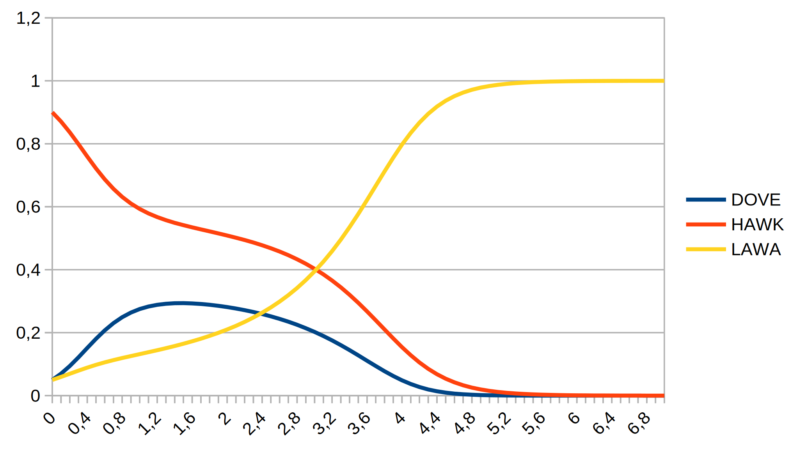

Miscellaneous models
====================

## Dove - Hawk - Law-Abider

This model from the field of social sciences "was described by Martinez Coll
[1986] who tried 'to develop a formal model of the Hobbesian state of nature
from the perspective of bioeconomics.' He defines Hobbes' state of nature as
a society whose members are continually competing with each other to obtain a
resource. All resources belong to someone, thus conflicts arise between
resource ownersand those who want an additional resource. Martinez Coll
follows Maynard Smith [1982] in that he endows the members of his model
society with one of three strategies: the Hawk, the Dove and the Law-Abiding
strategies." (ftp://ftp.uni-koblenz.de/outgoing/SozInf/kgt/SICSS/Chapter3.pdf)

The hawk-dove-law-abider macro model is on pages 32-43 in the book 
"Simulation for the Social Scientist" by Nigel Gilbert and Klaus Troitzsch.
The lines 32ff were added to generate print and plot output. Line 30 (LENGTH)
was adjusted to "7" (140 steps with DT=0.05).

Looks like that "law-abiding people" win in the end...
