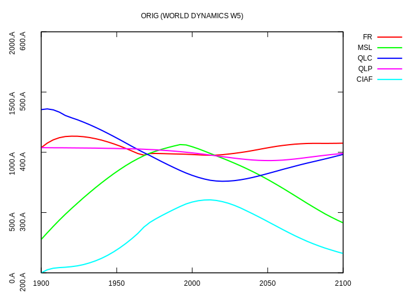
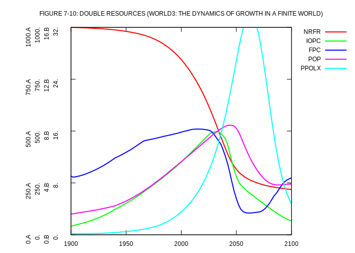
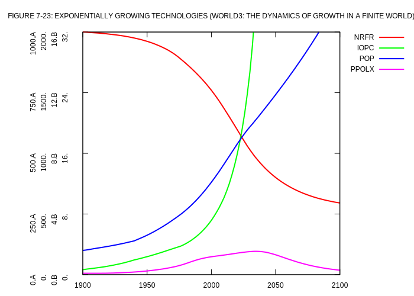
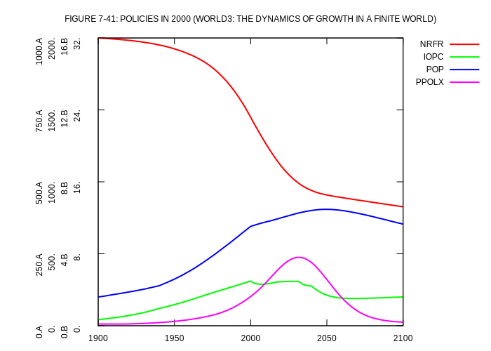

# World Dynamics

## WORLD2

<table>
<tr>
<td width="30%">

  

</td>
<td width="30%">

  

</td>
</tr>
</table>

## WORLD3

<table>
<tr>
<td width="30%">

  

</td>
<td width="30%">

  

</td>
</tr>
<tr>
<td width="30%">

  

</td>
<td width="30%">

  

</td>
</tr>
<tr>
<td width="30%">

  

</td>
<td width="30%">

  

</td>
</tr>
<tr>
<td width="30%">

  

</td>
<td width="30%">

  

</td>
</tr>
<tr>
<td width="30%">

  

</td>
<td width="30%">

  

</td>
</tr>
<tr>
<td width="30%">

  

</td>
<td width="30%">

  

</td>
</tr>
<tr>
<td width="30%">

  

</td>
<td width="30%">

  

</td>
</tr>
<tr>
<td width="30%">

  

</td>
<td width="30%">

  

</td>
</tr>
<tr>
<td width="30%">

  

</td>
<td width="30%">

  

</td>
</tr>
<tr>
<td width="30%">

  

</td>
<td width="30%">

  

</td>
</tr>
<tr>
<td width="30%">

  

</td>
<td width="30%">

  

</td>
</tr>
<tr>
<td width="30%">

  

</td>
<td width="30%">

  

</td>
</tr>
<tr>
<td width="30%">

  

</td>
<td width="30%">

  

</td>
</tr>
<tr>
<td width="30%">

  

</td>
<td width="30%">

  

</td>
</tr>
<tr>
<td width="30%">

  

</td>
<td width="30%">

  

</td>
</tr>
<tr>
<td width="30%">

  

</td>
<td width="30%">

  

</td>
</tr>
<tr>
<td width="30%">

  

</td>
<td width="30%">
</td>
</tr>
</table>

