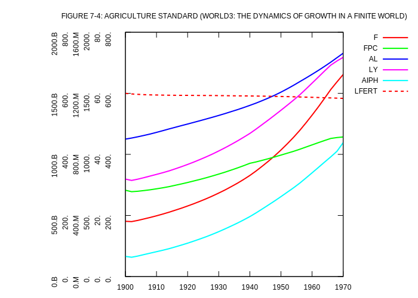
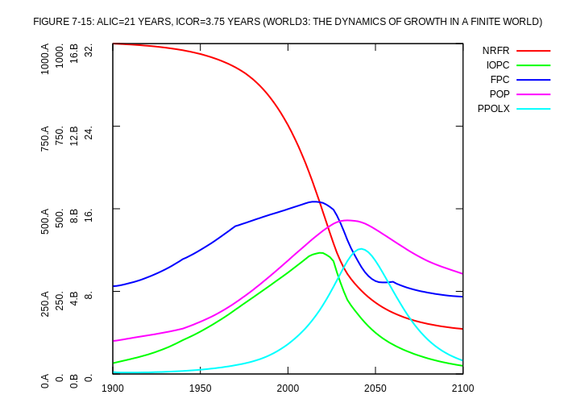
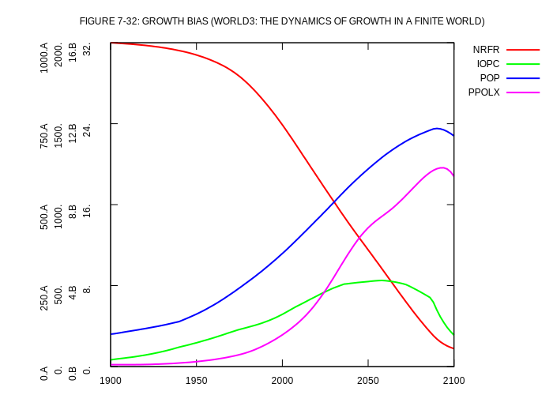
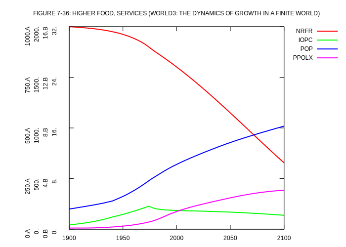

# World Dynamics

The world dynamics models have been manually re-typed from copies and scans of
books; it is possible that some typos have not yet been detected, leading to
corrupted models with wrong calculations and graphs. If you find a typo or any
other error, please contact me so I can fix the issue.

## WORLD2

### Changes to the original model

The [original code](world2-orig.dynamo) from the 1971 book **World Dynamics**
by _J.W. Forrester_ (Cambridge, Mass., ISBN 0262560186) was slightly adjusted in
the control cards; the original lines:

```
C     DT=.2
C     LENGTH=2100
N     TIME=1900
A     PRTPER.K=CLIP(PRTP1,PRTP2,PRSWT,TIME.K)
C     PRTP1=0
C     PRTP2=0
C     PRSWT=0
A     PLTPER.K=CLIP(PLTP1,PLTP2,PLSWT,TIME.K)
C     PLTP1=4
C     PLTP2=4
C     PLSWT=0
```

have been replaced by:

```
SPEC  DT=.2/LENGTH=2100/PRTPER=4/PLTPER=4
C     TIME=1900
```

N.B.: `PLTPER` and `PRTPER` can't be variable in the current version of the
DYNAMO interpreter.

### DYNAMO interpreter output

The following PLOTs have been generated with the GNUplot option:

<table>
<tr>
<td width="30%" valign="top">
<p align="center">
  
</p>
</td>
<td width="30%" valign="top">
<p align="center">
  
</p>
</td>
</tr>
</table>

## WORLD3

The [original code](world3-orig.dynamo) from the 1974 book **Dynamics of growth
in a finite world** by _Dennis Meadows_ et al. (Cambridge, Mass., ISBN 0960029443)
was adjusted to work with the DYNAMO interpreter:

### Changes to the original model

#### Control cards of the main deck

* The lines:

```
A     PLTPER.K=STEP(PLP,PLIT)
C     PLP=5
C     PLIT=1900
C     PRP=0
A     PRTPER.K=STEP(PRP,PRIT)+STEP(-PRP,PRTT)
C     PRIT=1900
C     PRTT=2100
```

were replaced with:

```
C     PLTPER=2
C     PRTPER=2
```

Like with the **WORLD2** model above, no variable `PLTPER` or `PRTPER` are
available in the current version of the interpreter.

* The PLOT commands have been changed to drop CBR (Crude Birth Rate) and CDR
(Crude Death Rate) from the plots. The reason for this is that all figures in
the book basically "ignore" these variables; dropping them from the plots makes
comparing the result of the original code and that of the DYNAMO interpreter
much easier.

#### Edit statements

Blocks of code starting with:

```
NOTE  ** THE FOLLOWING CHANGES MUST BE MADE IN EDIT MODE:
NOTE  ** :
```

are instructions on how to change the model in interactive-mode. Since the
DYNAMO interpreter does not have such a mode, the changes are done in
EDIT mode of the interpreter (replacing/adding equations in a named model).


### DYNAMO interpreter output

The following PLOTs have been generated with the GNUplot option:

<table>
<tr>
<td width="30%" valign="top">
<p align="center">
  
</p>
</td>
<td width="30%" valign="top">
<p align="center">
  
</p>
</td>
</tr>
<tr>
<td width="30%" valign="top">
<p align="center">
  
</p>
</td>
<td width="30%" valign="top">
<p align="center">
  
</p>
</td>
</tr>
<tr>
<td width="30%" valign="top">
<p align="center">
  
</p>
</td>
<td width="30%" valign="top">
<p align="center">
  
</p>
</td>
</tr>
<tr>
<td width="30%" valign="top">
<p align="center">
  
</p>
</td>
<td width="30%" valign="top">
<p align="center">
  
</p>
</td>
</tr>
<tr>
<td width="30%" valign="top">
<p align="center">
  
</p>
</td>
<td width="30%" valign="top">
<p align="center">
  
</p>
</td>
</tr>
<tr>
<td width="30%" valign="top">
<p align="center">
  
</p>
</td>
<td width="30%" valign="top">
<p align="center">
  
</p>
</td>
</tr>
<tr>
<td width="30%" valign="top">
<p align="center">
  
</p>
</td>
<td width="30%" valign="top">
<p align="center">
  
</p>
</td>
</tr>
<tr>
<td width="30%" valign="top">
<p align="center">
  
</p>
</td>
<td width="30%" valign="top">
<p align="center">
  
</p>
</td>
</tr>
<tr>
<td width="30%" valign="top">
<p align="center">
  
</p>
</td>
<td width="30%" valign="top">
<p align="center">
  
</p>
</td>
</tr>
<tr>
<td width="30%" valign="top">
<p align="center">
  
</p>
</td>
<td width="30%" valign="top">
<p align="center">
  
</p>
</td>
</tr>
<tr>
<td width="30%" valign="top">
<p align="center">
  
</p>

The above graph is not matching the figure in the book; this is certainly due
to a problem with the original source code: Translating the existing EDIT
instructions results in a model with two missing level equations:

```
L     LLYM1.K=...
L     LLYM2.K=...
```

The assumption to set them to be constant at value 1.0 is obviously wrong.

</td>
<td width="30%" valign="top">
<p align="center">
  
</p>
</td>
</tr>
<tr>
<td width="30%" valign="top">
<p align="center">
  
</p>
</td>
<td width="30%" valign="top">
<p align="center">
  
</p>
</td>
</tr>
<tr>
<td width="30%" valign="top">
<p align="center">
  
</p>

The above graph is not matching the figure in the book; this is certainly due
to a problem with the original source code: Translating the existing EDIT
instructions results in a model with a missing constant equations:

```
C     GGPF1=...
```

The assumption to set this constant to value 1.0 is obviously wrong.
</td>
<td width="30%" valign="top">
<p align="center">
  
</p>
The model used to generate this graph is based on "Figure 7-30", a model with
known problems. The graph is therefore not matching the corresponding figure
in the book.
</td>
</tr>
<tr>
<td width="30%" valign="top">
<p align="center">
  
</p>
</td>
<td width="30%" valign="top">
<p align="center">
  
</p>
</td>
</tr>
<tr>
<td width="30%" valign="top">
<p align="center">
  
</p>
</td>
<td width="30%" valign="top">
<p align="center">
  
</p>
</td>
</tr>
<tr>
<td width="30%" valign="top">
<p align="center">
  
</p>
</td>
<td width="30%" valign="top">
<p align="center">
  
</p>
</td>
</tr>
<tr>
<td width="30%" valign="top">
<p align="center">
  
</p>
The model used to generate this graph is based on "Figure 7-30", a model with
known problems. The graph is therefore not matching the corresponding figure
in the book.
</td>
<td width="30%" valign="top">
</td>
</tr>
</table>
